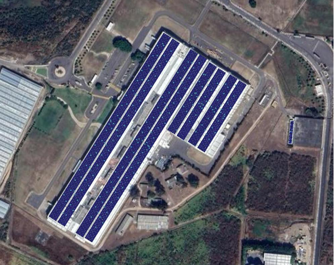

```{=html}
<section class="about-hero">
  <div class="about-hero__inner">
    <div class="about-hero__copy">
      <span class="about-hero__eyebrow">Quiénes somos</span>
      <h1 class="about-hero__title">Ingeniería solar con sello RENOVAM</h1>
      <p class="about-hero__lead">En RENOVAM transformamos la manera en que hogares, comercios e industrias producen y consumen energía. Diseñamos soluciones limpias, eficientes y personalizadas que impulsan la transición energética de México.</p>
      <p class="about-hero__mission">Somos una empresa 100&nbsp;% mexicana con enfoque integral: combinamos análisis energético, ingeniería certificada y gestión documental para entregar resultados reales y medibles.</p>
    </div>
    <div class="about-hero__media">
      <h2>Experiencia en proyectos de baja y media tensión</h2>
      <ul class="about-hero__points">
        <li>Metodología propia que une diagnóstico, ingeniería, instalación y operación.</li>
        <li>Equipo acreditado EC1181 con experiencia en proyectos de media y baja tensión.</li>
        <li>Monitoreo, mantenimiento y soporte técnico continuo para asegurar desempeño.</li>
      </ul>
    </div>
  </div>
</section>
```

```{=html}
<section class="about-expertise">
  <h2 class="about-section-title">Experiencia comprobada</h2>
  <div class="about-expertise__grid">
    <article class="about-expertise__card about-expertise__card--industrial">
      <span class="about-expertise__label">Industrial</span>
      <h3>480 paneles en Atoyac &middot; 340 paneles en CDMX</h3>
      <p>Proyectos para recibos de media tensión de $30,000 a $7,000,000 MXN mensuales con redundancia operativa.</p>
    </article>
    <article class="about-expertise__card about-expertise__card--commercial">
      <span class="about-expertise__label">Comercial</span>
      <h3>6 fraccionamientos &middot; 27 negocios</h3>
      <p>Integraciones en retail, oficinas y manufactura que alcanzan hasta 99&nbsp;% de ahorro en facturación CFE.</p>
    </article>
    <article class="about-expertise__card about-expertise__card--residential">
      <span class="about-expertise__label">Residencial</span>
      <h3>146 instalaciones inteligentes</h3>
      <p>Sistemas de 4 a 24 paneles con monitoreo en tiempo real, soluciones híbridas y soporte personalizado.</p>
    </article>
  </div>
</section>
```

```{=html}
<section class="about-projects">
  <div class="about-projects__header">
    <h2 class="about-section-title">Proyectos que generan confianza</h2>
    <p>Participamos en iniciativas estratégicas de gran escala a través de alianzas que aportan nuestra ingeniería, instalación y gestión.</p>
  </div>
```

:::{.case-gallery layout-ncol="3"}

::: {.case-card}

{.case-card__image}

**Parque industrial en Yecapixtla** – 60 MW

Memoria de cálculo, análisis financiero y análisis de producción. El recibo mensual pasó de $3,273,371 pesos a solo $1,163,335 pesos y la instalación se encuentra en proceso.

:::

::: {.case-card}

{.case-card__image}

**Proyecto híbrido aislado en centro de salud para San José de Pala**

Proyecto híbrido aislado de centro de salud en San José de Pala, Morelos para alimentación continua de refrigeradores con medicinas.

:::

::: {.case-card}

{.case-card__image}

**Instalación de 6 sistemas aislados en Tantoyuca, Veracruz**

Análisis energético, dimensionamiento de sistemas e instalación para ranchos ubicados en la región.

:::

:::

```{=html}
</section>
```

```{=html}
<section class="about-team">
  <div class="about-team__header">
    <h2 class="about-section-title">Nuestro equipo</h2>
    <p>RENOVAM está liderado por especialistas en energías renovables egresados del Instituto de Energías Renovables de la UNAM.</p>
  </div>
  <article class="about-team__profile-card about-team__profile-card--equipo">
    <div class="about-team__profile-backdrop" aria-hidden="true"></div>
    <div class="about-team__profile-content">
      <h3 class="about-team__profile-title">Liderazgo en ingeniería solar</h3>
      <div aria-hidden="true" class="about-team__space about-team__space--pre-members"></div>
      <div class="about-team__members">
        <div class="about-team__member">
          <h3>Ing. Cristóbal Valdos Mayo</h3>
          <p>Especialista en climatización solar, biocombustibles y electromovilidad con enfoque en integración tecnológica.</p>
        </div>
        <div class="about-team__member">
          <h3>Ing. Oscar Zagal Olvera</h3>
          <p>Responsable de proyectos fotovoltaicos, microredes, sistemas aislados y respaldo de emergencia.</p>
        </div>
      </div>
      <div aria-hidden="true" class="about-team__space about-team__space--pre-note"></div>
      <p class="about-team__note">Ambos cuentan con certificación EC1181 para supervisar sistemas fotovoltaicos residenciales, comerciales e industriales.</p>
    </div>
  </article>
</section>
```
